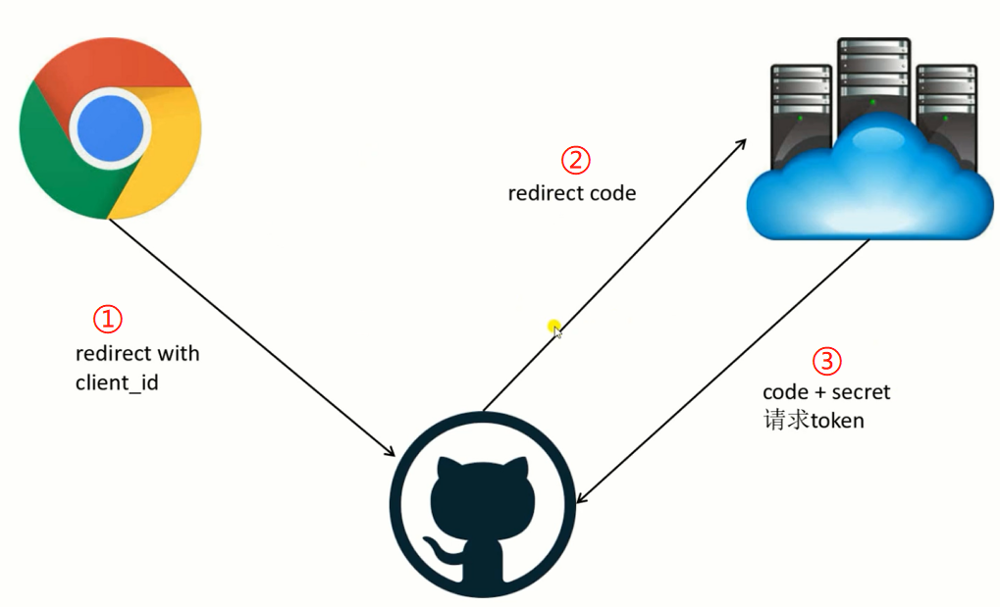

# 模块版本


# Next.js

nextjs 用到自己开的服务器，只能处理 ssr 渲染，但是不能处理数据接口，连接数据库等操作。所以我们要 next 作为 koa 中间件使用。这样能做到更多服务端的作用。

[文章](https://www.cnblogs.com/escapist/p/11371319.html)

## 集成koa

```
yarn add koa
```

[集成自定义服务器的文档](https://www.nextjs.cn/docs/advanced-features/custom-server)


## 集成antd

```

```


## 路由

### 动态路由 —— query

```js
// 发送方式
// 1.Router
Router.push({
  pathname: '/test',
  query:{
    id:2
  }
})
// 2.Link
<Link href='/a?id=1' title='AA'>
  something
</Link>

// 接收 withRouter
const Index = ({router}) => <div>{router.query.id}</div>
export default withRouter(Index);
```

### 路由映射

也就是 react-router-dom 能实现的 /id/2

```js
<Link href='/a?id=1' as='/a/1' title='AA'>
  something
</Link>

Router.push({
  pathname: '/test',
  query:{
    id:2
  }
}, '/test/2')
```

**但是存在很大的问题！**

如果我直接输入url /test/2，显示404！因为这个路由是在 `Link` 点击事件时映射出来的，是浏览器端的操作。但是直接输入 url 属于向服务器端请求，所以请求到了404。将 koa 集成在next里面也是为了解决这个问题。

**解决办法：**

```js
// 自定义配置服务器路由
const router = new Router();

  router.get('/a/:id', async ctx => {
    const id = ctx.params.id;
    await handle(ctx.req, ctx.res, {
      pathname: '/a',
      query: { id },
    });
    ctx.respond.false;
  });
  server.use(router.routes());
```

### 路由钩子

```js
const events = [
  'routeChangeStart',
  'routeChangeComplete',
  'routeChangeError',
  'beforeHistoryChange',
  'hashChangeStart',
  'hashChangeComplete',
];
function makeEvent(type) {
  return (...args) => {
    console.log(type, ...args);
  };
}
events.forEach(event => Router.events.on(event, makeEvent(event)));
```


## getInitialProps

nextjs 的数据获取规范！！！

- **在页面中获取数据**
- **在App中获取全局数据**

**注意：这个API 只能在 pages 里面的文件使用，因为 pages里面才有路由功能，路由完成前执行这个 getInitialProps 函数**

```js
A.getInitialProps = () => {
  // 如果直接输入url请求服务器端，这条杠不出现。说明getInitialProps这个函数是直接在服务端请求的，而不是页面渲染之后再请求数据。
  // 不需要等到客户端加载完js才渲染数据，更高效
  console.log('-------------');
  return {
    name: 'zjj',
  };
};
```

**注意，也有一定缺陷。他的封装思想是等数据获取到了再加载页面**

```js
A.getInitialProps = async () => {
  const promise = new Promise(resolve => {
    setTimeout(() => {
      resolve({
        name: 'zjj',
      });
    }, 1000);
  });
  return await promise;
};
```

如果你想先显示页面再加载数据，next办不到。服务端渲染框架！


## ⭐自定义_App.js

### 1. 固定Layout

### 2. 保持一些redux等

### 3. 给页面传入一些自定义数据

### 4. 自定义错误处理


## ⭐自定义_document.js

**只有在服务端渲染的时候才会被调用，用来修改服务端渲染的文档内容。**配合第三方 css-in-css 方案使用。比如 `styled-components`

给body添加了整体样式！

```js
render() {
    return (
      <Html>
        <style>{'.test{color:red}'}</style>
        <Head />
        <body className="test">
          <Main />
          <NextScript />
        </body>
      </Html>
    );
  }
```


## 集成 `styled-components` 

自定义强化App 和 Component 的方法：

```js
// _document.js
function withLog(Comp) {
  return props => {
    console.log(props);
    return <Comp {...props} />;
  };
}

class MyDocument extends Document {
  static async getInitialProps(ctx) {
    const originalRenderPage = ctx.renderPage;
    ctx.renderPage = () =>
      originalRenderPage({
        enhanceApp: App => withLog(App),
        enhanceComponent: Component => withLog(Component),
      });

    const initialProps = await Document.getInitialProps(ctx);
    return { ...initialProps };
  }

  render() {
    return (
      <Html>
        <Head></Head>
        <body>
          <Main />
          <NextScript />
        </body>
      </Html>
    );
  }
}

export default MyDocument;
```


**引入 styled-components 的方法：**[文档](https://blog.csdn.net/weixin_44677431/article/details/90339631)

```js
// _document.js
import Document, { Html, Head, Main, NextScript } from 'next/document';
import { ServerStyleSheet } from 'styled-components';

class MyDocument extends Document {
  static async getInitialProps(ctx) {
    const sheet = new ServerStyleSheet();
    const originalRenderPage = ctx.renderPage;

    try {
      ctx.renderPage = () =>
        originalRenderPage({
          enhanceApp: App => props => sheet.collectStyles(<App {...props} />),
        });
      const props = await Document.getInitialProps(ctx);
      return {
        ...props,
        styles: (
          <>
            {props.styles}
            {sheet.getStyleElement()}
          </>
        ),
      };
    } finally {
      sheet.seal();
    }
  }

  render() {
    return (
      <Html>
        <Head></Head>
        <body>
          <Main />
          <NextScript />
        </body>
      </Html>
    );
  }
}

export default MyDocument;
```

```js
.babelrc配置
{
  "presets": ["next/babel"],
    "plugins": [
      [
        "styled-components",{ "ssr":true } 
      ]
  ]
}
```


## LazyLoading


### 异步加载模块

例如 moment 模块

```js
yarn add moment
```

如果一般以上的 pages 用到了 moment，那么会提取成公共模块，每次渲染页面 js 都加载这个模块的代码，浪费性能。所以要用到优化，异步加载模块。把模块加载放到异步的 `getInitialProps` 中去。

```js
A.getInitialProps = async () => {
  const moment = await import('moment');
  const promise = new Promise(resolve => {
    setTimeout(() => {
      resolve({
        name: 'zjj',
        time: moment.default(Date.now() - 60 * 10000).fromNow(),
      });
    }, 1000);
  });
  return await promise;
};
```

### 异步加载组件

```js
import dynamic from 'next/dynamic';
const Comp = dynamic(import('../components/comp'));
```


## nextjs 的配置文件

next.config.js

```js
const configs = {
  // 编译文件输出目录
  distDir: 'dest',
  // 是否给每个路由生成Etag
  generateEtags: true,
  // 页面内容缓存配置
  onDemandEntries: {
    // 内容在内存中缓存的时长（ms）
    maxInactiveAge: 25 * 1000,
    // 同时缓存多少个页面
    pagesBufferLength: 2,
  },
  // 在pages目录下哪种后缀文件会被认为是页面
  pageExtensions: ['jsx', 'js'],
  // 配置buildId
  generateBuildId: async () => {
    if (process.env.YOUR_BUILD_ID) {
      return process.env.YOUR_BUILD_ID;
    }
    // 返回null使用默认的unique id
    return null;
  },
  // 手动修改webpack config
  webpack(config, options) {
    return config;
  },
  // 修改webpackDevMiddleware配置
  webpackDevMiddleware: config => {
    return config;
  },
  // 可以在页面上通过 process.env.customKey 获取 value
  env: {
    customKey: 'value',
  },
  // 下面两个要通过 'next/config' 来读取
  // 只有在服务端渲染时才会获取的配置
  serverRuntimeConfig: {
    mySecret: 'secret',
    secondSecret: process.env.SECOND_SECRET,
  },
  // 在服务端渲染和客户端渲染都可以获取的配置
  publicRuntimeConfig: {
    staticFolder: '/static',
  },
};

if (typeof require !== 'undefined') {
  require.extensions['.css'] = file => {};
}

module.exports = {
  distDir: 'dest',
};
```

例如，只能在服务端拿到的config

```js
module.exports = {
  serverRuntimeConfig: {
    mySecret: 'secret',
    secondSecret: process.env.SECOND_SECRET,
  },
  // 在服务端渲染和客户端渲染都可以获取的配置
  publicRuntimeConfig: {
    staticFolder: '/static',
  },
};

// 页面中能拿到
import getConfig from 'next/config';
const { serverRuntimeConfig, publicRuntimeConfig } = getConfig();
console.log(serverRuntimeConfig, publicRuntimeConfig);
```


## ssr流程

### 1. 请求服务端渲染流程

浏览器发起 /page 请求 ==> koa 接收到请求并调用nextjs ==> nextjs开始渲染 ==> 调用 _app.js 和 _document.js  的 getInitialProps ==> 调用页面的 getInitialProps ==> 最终渲染html ==> 返回给浏览器进行渲染

**服务端会同时把所有数据用json格式传给客户端浏览器，客户端通过这些数据来进行相应渲染。所以客户端也共享了这些数据，数据可以在客户端进行复用。**

### 2. 客户端点击跳转流程

点击链接按钮 ==> 异步加载页面的组件js ==> 调用页面的 getInitialProps ==> 数据返回，路由变化 ==> 渲染页面


## hooks闭包陷阱

```js
export default () => {
  const [count, setCount] = useState(0);

  const alertHandler = () => {
    setTimeout(() => alert(count), 2000);
  };

  return (
    <div>
      <button onClick={() => setCount(count + 1)}>add</button>
      <button onClick={alertHandler}>alert</button>
      <p>{count}</p>
    </div>
  );
};
```

上面的例子，2秒后alert出来的是当时按下 `alert` 键时候的 `count` ！因为按下 `alert` 键的那一刻才创造出 `alertHandler` 函数并执行。所以用到的是当时的 count 。 这就是闭包陷阱，创造出 alertHandler 函数闭包。

再看下面类组件的例子：

```js
export default class C extends React.Component {
  state = {
    count: 0,
  };
  alertHandler = () => {
    setTimeout(() => alert(this.state.count), 2000);
  };
  render() {
    return (
      <div>
        <button onClick={() => this.setState({ count: this.state.count + 1 })}>add</button>
        <button onClick={this.alertHandler}>alert</button>
        <p>{this.state.count}</p>
      </div>
    );
  }
}
```

乍一看，似乎，好像类组件和函数组件不太相同，类组件能正常更新到最新的 `count` 进行 `alert` 。但是！如果要是这么写！

```js
alertHandler = () => {
  const { count } = this.state;
  setTimeout(() => alert(count), 2000);
};
```

**原因：`this.state.count` 其实是个引用性质的变量。如果提前提取出来值，我们就能进行即使的保存，所以本质上，都是一样，异步的函数会在执行的时候创造，里面的内容也是当时的内容，不会更新。**

**函数组件保持实时更新的方法：**

```js
  const countRef = useRef();
  countRef.current = count;

  const alertHandler = () => {
    setTimeout(() => alert(countRef.current), 2000);
  };
```

**能成功的原因，`useRef` 每次都返回同一个对象！ `{current:..., ...}`**

 **这里还有一个坑！！ `createRef` **

```js
  const countRef = createRef();
  countRef.current = count;

  const alertHandler = () => {
    setTimeout(() => alert(countRef.current), 2000);
  };
```

同样的方式，`createRef` 却失败了，本质上， `createRef` 根据值的变化，创造了新的对象！！！

[createRef和useRef的区别](https://blog.csdn.net/ascoders/article/details/104624385/)


## next集成redux


# Koa

`ctx.path` 能获取请求的路径；`ctx.method` 获取请求方式。

有多个的时候一定要执行 `await next()` 才能进入下一个

```js
server.use(async (ctx, next) => {
  ctx.body = '<span>哈哈哈</span>';
  await next();
});
server.use(async (ctx, next) => {
  ctx.body = '<span>哟呵呵</span>';
});
```

## koa-router使用

```js
const Router = require('koa-router');
const server = new Koa();
const router = new Router();
router.get('/test', ctx => {
  ctx.body = '<p>用了router /test</p>';
});

server.use(async (ctx, next) => {
  await next();
});
server.use(router.routes());
```

**如果返回 json 数据格式，用 set 来设置响应数据的头**

```js
router.get('/test/:id', ctx => {
  ctx.body = { success: true }; // 如果返回的是json格式时要设置请求头
  ctx.set('Content-Type', 'application/json');
});
```


# redis缓存数据库

[windows安装](https://github.com/microsoftarchive/redis/releases)

windows系统默认时开机自启动redis，如果想要手动开启：

```
找到redis安装目录
.\redis-server.exe .\redis.windows.conf
查看是否启动了,记得加入环境变量
redis-cli
```


## 基本使用

内存数据结构存储 —— 快速读取。也可以可持久存储


### 密码登录

1. 进入 redis.window.conf 配置文件，更改端口为6378，不是6379就行

2. requirepass foobared ，把后面的改为想设置的密码

3. 启动这个6378端口的数据库

   ```
   C:\Program Files\Redis> .\redis-server.exe .\redis.windows.conf
   ```

4. 用命令进入6378端口的数据库

   ```
   redis-cli -p 6378
   auth 123456
   ```

### 基本操作

1. 过期时间设置：

   ```
   setex c 10 1 | key time value | 给某个key设置过期时间 
   ```

2. redis只能存储 key-value 所以为了避免重复的 key 覆盖前面的，要设计好前缀。例如用在 session 里的 用 `session:sessionId 123`

3. KEYs * 获取所有的key ， 删除 DEL a

### nodejs连接redis

用包 [ioredis]()

```js
const Redis = require('ioredis');

const redis = new Redis({
  port: 6378,
  password: 123456,
});

async function test() {
  const keys = await redis.keys('*');
  console.log(keys);
  console.log(await redis.set('lala', 23));
}
test();
```


# ⭐oAuth授权登录

多种授权方式：

- Authorization Code：最好
- Refresh Token：通过协议到授权方获得一个 token，如果过期，再根据 refresh token 获得一个新的token。好处是不需要客户端再发起一个 oAuth 。**如果想让用户获得一次授权后不需要再授权就可以用这个方式，交互体验好。**
- Device Code：电视端通过授权码之类的方式，因为电视没有键盘操作方便，所以用简单的数字码实现。
- Password：直接在网站上展示 github 网站登录界面，但一般不给第三方授权。
- Implicit：现在不用了
- Client Credential：不常用


## Oauth code 授权流程


**流程如下：**



 1. 客户端跳转到 github 的授权网站，并携带 `client_id` 参数

    ```js
    url:'https://github.com/login/oauth/authorize?client_id=887cd757babf66918d15&scope=user,repo'
    ```

    

 2. github 端成功授权后跳转到原来的网站，并且携带 `code` 参数，网站客户端进行处理后要返回 `code + client_secret`  ，再发送给 github 网站后收到一个 token，就能获取到信息了。

 3. 把这个 `access_token` 存入到 `session` 中去

 4. 通过 `session` 发送 `cookie` 到客户端，就不需要多次请求了。


# 项目

## 1. 项目需求

搜索页面，根据不同分类来搜索。仓库详情，能查看 issue 等待解决的问题等。

**重要点：**

- 缓存的实现：回退直接显示页面，将前一个页面缓存在浏览器中。
- loading 的动画，用户体验感好
- 登陆后，个人信息存储在前台，不需要再请求后台，直接显示登录页面


